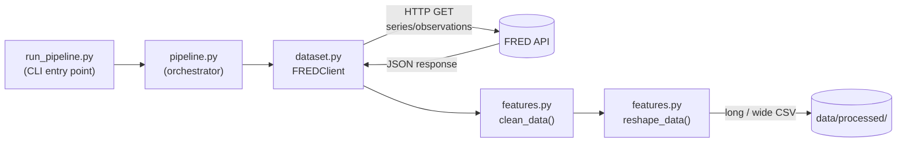

# fred_data_fetcher

<a target="_blank" href="https://cookiecutter-data-science.drivendata.org/">
    
</a>

A reusable **Cookiecutter Data Science** template for fetching, cleaning, and storing free economic data from the [FRED API](https://fred.stlouisfed.org/docs/api/fred/) (Federal Reserve Economic Data). Fork it, modify the series list, and use it as a starting point for any data science or economics project that needs reliable macroeconomic data.

> **Author:** eoneine

---

## How It Works



### Flow

1. **User** runs `run_pipeline.py` from the terminal with arguments (series, date range, format).
2. **`pipeline.py`** reads config & arguments, then creates a `FREDClient` instance.
3. **`FREDClient`** sends an HTTP GET request to the FRED API endpoint for each requested series.
4. **`features.py`** cleans the data (type conversion, handles FRED's missing value marker `"."`) and reshapes it into long or wide format.
5. The result is saved as a CSV in `data/processed/` with a descriptive filename.

---

## FRED API Endpoint

This project currently uses **one endpoint**:

| Endpoint | Description |
|---|---|
| [`series/observations`](https://fred.stlouisfed.org/docs/api/fred/series_observations.html) | Fetches observation data (date + value) for a given series ID |

**Key parameters used:**

| Param | Description |
|---|---|
| `series_id` | Series code, e.g. `GDP`, `UNRATE`, `CPIAUCSL` |
| `api_key` | Your FRED API key |
| `file_type` | `json` |
| `observation_start` | (optional) Start date `YYYY-MM-DD` |
| `observation_end` | (optional) End date `YYYY-MM-DD` |

> **Future updates:** Additional endpoints such as `series/search` (search series by keyword), `series` (series metadata), and `releases` (data release schedules) may be added.

📖 **Full FRED API documentation:** https://fred.stlouisfed.org/docs/api/fred/

---

## Setup

### 1. Install dependencies

```bash
pip install -r requirements.txt
```

### 2. Create a `.env` file in the project root

```
FRED_API_KEY=your_api_key_here
```

Get a free API key at: https://fred.stlouisfed.org/docs/api/api_key.html

---

## Usage

### Run the pipeline with defaults (GDP, UNRATE, CPIAUCSL — full history — long format)

```bash
python run_pipeline.py
```

### Select specific series

```bash
python run_pipeline.py --series GDP FEDFUNDS
```

### Select a date range

```bash
python run_pipeline.py --series GDP UNRATE --start 2020-01-01 --end 2024-12-31
```

### Select output format (long or wide)

```bash
python run_pipeline.py --series GDP UNRATE CPIAUCSL --start 2015-01-01 --format wide
```

### Example output filename

```
data/processed/dataset_fred_GDP_UNRATE_2020-01-01_to_2024-12-31_long.csv
```

---

## Running Tests

```bash
pytest
```
---

## Sample Data

Want to see what the output looks like before running the pipeline? Check the `references/` folder for sample CSV files.

---

## Project Organization

```
├── .env                          ← FRED_API_KEY (do not commit)
├── LICENSE
├── Makefile
├── README.md
├── pyproject.toml
├── requirements.txt
├── run_pipeline.py               ← CLI entry point
│
├── data/
│   ├── raw/
│   ├── interim/
│   ├── processed/                ← output CSVs are saved here
│   └── external/
│
├── notebooks/                    ← exploration notebooks
│
├── fred_data_pipeline/           ← main package
│   ├── __init__.py
│   ├── config.py                 ← loads .env, constants (BASE_URL, paths, SERIES_IDS)
│   ├── dataset.py                ← FREDClient class (fetches data from the API)
│   ├── features.py               ← clean_data() + reshape_data() (long/wide)
│   ├── pipeline.py               ← orchestrator, called by run_pipeline.py
│   └── modeling/                 ← place your modeling code here (train, predict, etc.)
│
├── reports/figures/
├── references/
└── tests/
    └── test_data.py
```

--------
